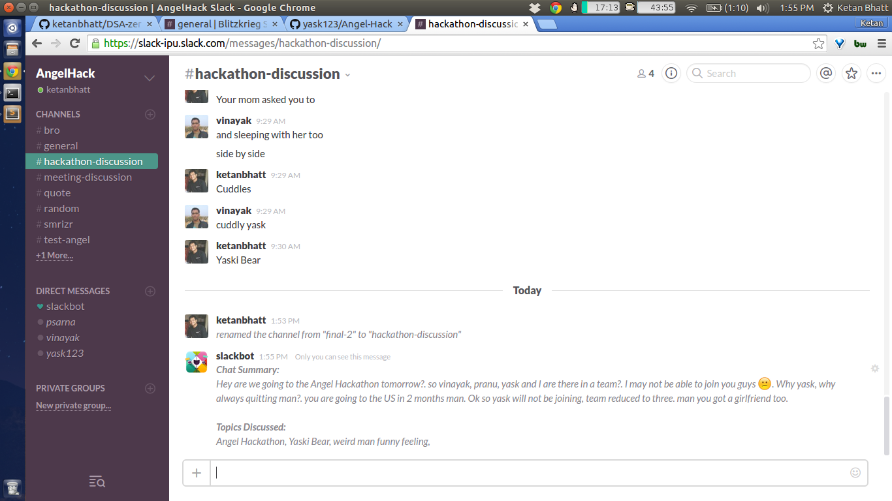

# Summarize It!

Summarize it is a chat summarizer plugin for instant messaging applications. It summarizes the large content of chat logs which enables users to quickly understand the current context of the conversation. Currently Summarize it works on top of Slack as its plugin.

## How it works

We use [TextRank](http://web.eecs.umich.edu/~mihalcea/papers/mihalcea.emnlp04.pdf) to extract important sentences from the chat text. It tokenizes the text into sentences and builds a graph with the sentences as nodes, assigning them same scores. Sentences are then ranked by recursively; a sentence 1 points to another sentence 2 when they have similar features. A score is assigned to 2 taking in account the scores of sentences that pointed to 1. Lastly, sentences are ranked in decreasing order.

To read the story behind this hack, please see this [blog post](http://vortex-ape.github.io/posts/2015/June/26/summarize-it/).

## Installing Summarize It plugin for your slack
1. Create a token for your team `https://api.slack.com/web` 
2. Clone/fork this repository and create a file "config.py" like so:
    `keys = {
        "slack": "your-token-here"
    }`
3. Deploy the app at heroku/IBM bluemix etc.
4. Visit `https://<your-team-name>.slack.com/services/new/slash-commands`
5. Enter the command name you wish to use
6. Enter the request url as `<your-deployed-app-url>/slack`

## Using Summarize It plugin with slack
Type /your-command to initiate the plugin. The plugin will automatically summarize the above chat contents and display the summary.

## Screenshots

#### Hackathon Discussion

#### Meeting Discussion

## Authors and Contributors
Yask Srivastava, [Ketan Bhatt](https://github.com/ketanbhatt), [Pranu Sarna](https://github.com/psarna94) and [Vinayak Mehta](https://github.com/vortex-ape).

## Support or Contact
Having trouble with summarize it? Create an issue in the repository GitHub Repo.

